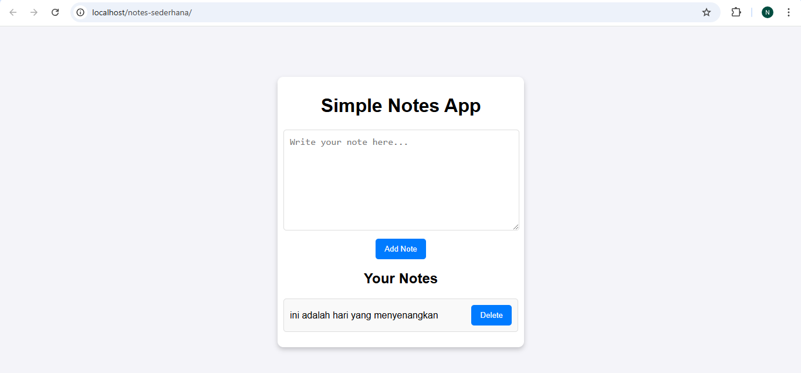

# Simple Notes App  

A simple web application to manage your notes. Built using HTML, CSS, JavaScript, PHP, and MySQL.  

## Features  
- Add new notes  
- View all saved notes  
- Delete notes  
- Persistent storage using MySQL  

## Prerequisites  
- Laragon (or any local server environment)  
- MySQL database  
- HeidiSQL (or phpMyAdmin) to manage the database

## Setup Instructions  

1. **Clone the Repository**  
   ```bash  
   git clone https://github.com/nabilaakhairunnisa/simple-notes.git  
   cd simple-notes  
   ```  

2. **Set Up the Database**  
   - Open HeidiSQL or phpMyAdmin.  
   - Create a new database named `notes_app`.  
   - Run the following SQL query to create the `notes` table:  
     ```sql  
     CREATE DATABASE notes_app;  
     USE notes_app;  
     CREATE TABLE notes (  
         id INT AUTO_INCREMENT PRIMARY KEY,  
         content TEXT NOT NULL,  
         created_at TIMESTAMP DEFAULT CURRENT_TIMESTAMP  
     );  
     ```  

3. **Configure the Server**  
   - Place the project folder in Laragon's `www` directory (e.g., `C:/laragon/www/simple-notes`).  

4. **Start Laragon**  
   - Ensure Apache and MySQL are running.  

5. **Access the Application**  
   - Open your browser and go to `http://localhost/simple-notes`.  

## Usage  
- **Add Note:** Type your note in the text box and click the "Add Note" button.  
- **View Notes:** Notes will automatically display below the form.  
- **Delete Note:** Click the "Delete" button next to a note to remove it.  

## Technologies Used  
- Frontend: HTML, CSS, JavaScript  
- Backend: PHP  
- Database: MySQL  

## Screenshots  
  
